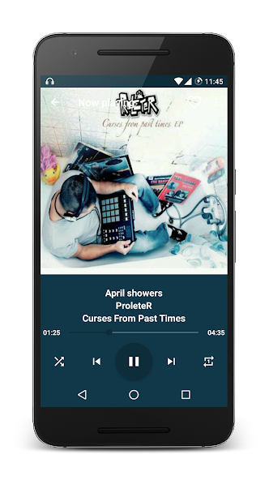
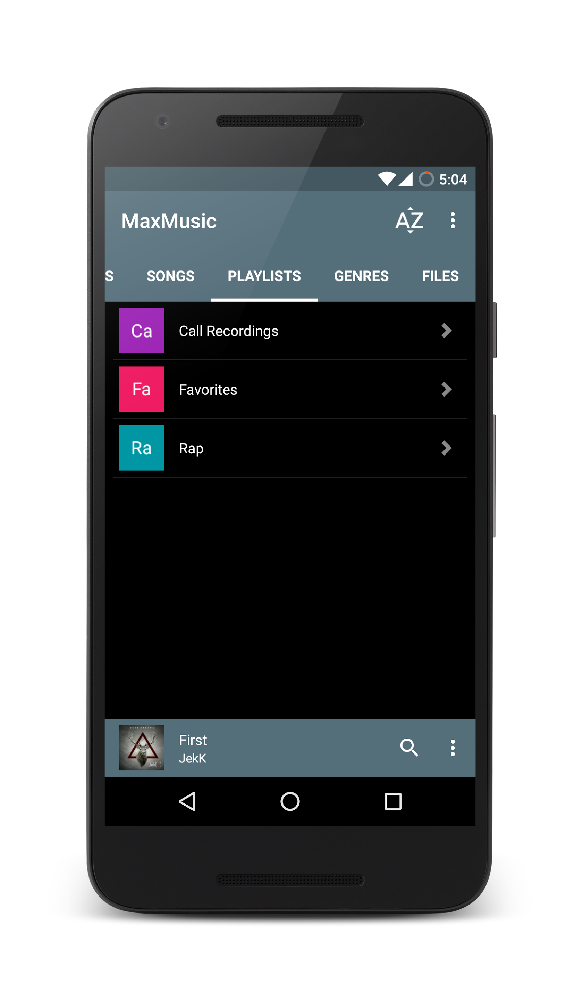
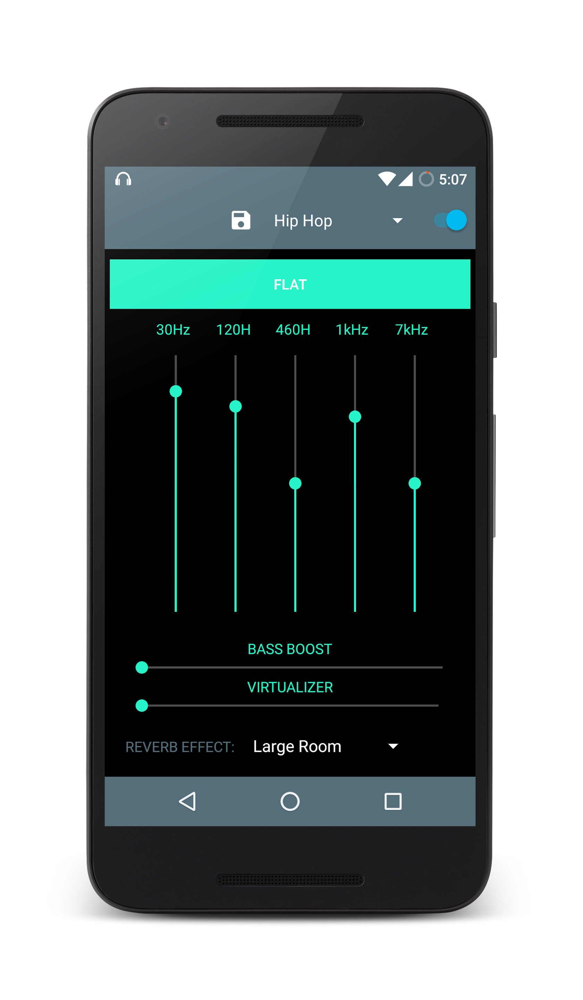
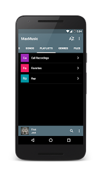
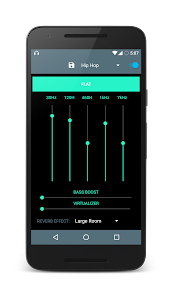

# MaxMusic

MaxMusic is a powerful and lightweight music player for Android that offers advanced controls, extensive customization, and a superior listening experience. It is completely ad-free and packed with features designed for music lovers who value both functionality and aesthetics.

## screenshots

           

## Features

- **Ample theming customizations**  
- **Small size**  
- **Ad-free experience**  
- **Comprehensive playback controls**  
- **Meta tag editing**  
- **Equalizer with custom presets**  
- **Lyrics fetching**  
- **Set and share ringtones**  
- **Supports all Android API levels from ICS to Nougat**  
- **Sleep timer and idle timeout**  
- **Tag-based navigation**  
- **Gapless playback**  
- **Android Wear support (stock broadcasts)**  
- **Notification and lockscreen controls**  
- **Replay gain support**  
- **Swipe and shake controls**  
- **Play songs directly from folders**  
- **Easily enqueue tracks**  

## Play Store
[Download MaxMusic from Google Play](https://play.google.com/store/apps/details?id=com.dragonide.maxmusic&hl=en)

## Help Translate
[Help translate MaxMusic into your language](https://goo.gl/xBzJSB)

## Licensing
Tracks used in the app screenshots are licensed under Creative Commons Licensing 3.0 by Jamendo.com. [Learn more](https://creativecommons.org/licenses/by/3.0/).

For more information, visit the [MaxMusic project page](https://ankitmhatre.in/projects/maxmusic/).
